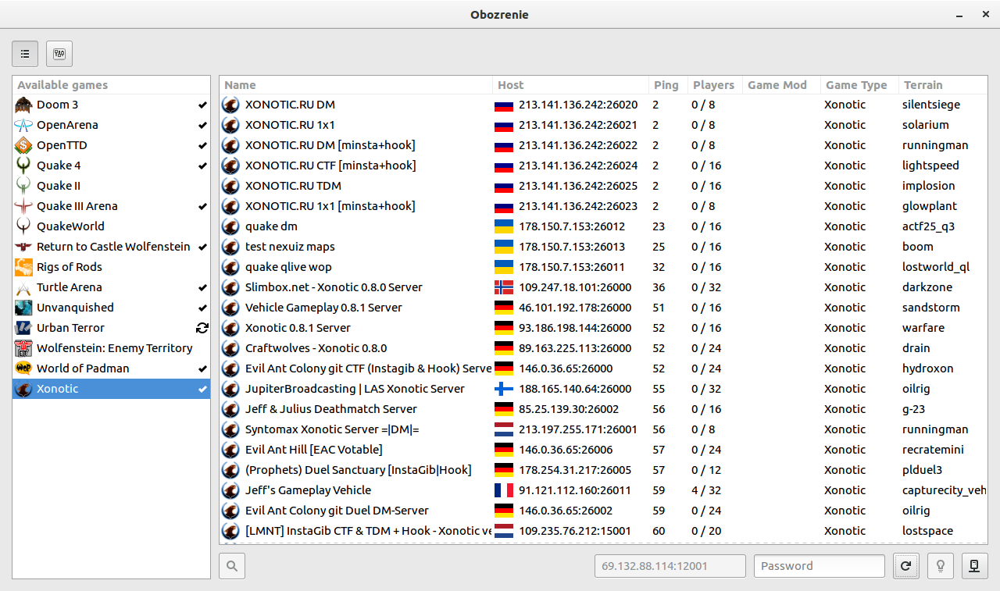

Simple and easy to use game server browser for Linux.

## Project status note (2016-06-13)
Right now Obozrenie is considered feature-complete and ready for general usage.

However, the fact that I chose Python as the language of code led to significant hurdles in terms of application performance, maintainability and shipping today. I am looking into rewriting Obozrenie in a lower level language (like Vala or Go) for better speed and maintainability.

Therefore, new **features** are not likely to be implemented in this codebase. **Game support**, however, will expand on request. Nevertheless you are welcome to voice your wishes at issue tracker.

## Overview
Obozrenie is a game server browser that can be used to access information about and connect to multiplayer servers.

## Features
- Fast, fully threaded stat engine
- Easy to use, elegant, uncluttered GUI
- Supports various backends, designed for modularity.

## Screenshot

## Dependencies
### Required:
- [Python 3.11+](https://python.org)
- [PyGObject with GTK+ 3](https://pygobject.gnome.org)
- [PyXDG](https://www.freedesktop.org/wiki/Software/pyxdg/)
- [tomli-w](https://github.com/hukkin/tomli-w) (TOML writing; reading uses the standard-library `tomllib`)
- [xmltodict](https://github.com/martinblech/xmltodict)
- [requests](https://requests.readthedocs.io)

### Optional:
- [QStat](https://github.com/multiplay/qstat) - for QStat backend support
- [Babel](https://babel.pocoo.org) - for translation support
- [maxminddb](https://github.com/maxmind/MaxMind-DB-Reader-python) and [pycountry](https://github.com/pycountry/pycountry) - for geolocation support. Obozrenie reads a MaxMind DB country database (`.mmdb`). It probes common system locations (e.g. `/usr/share/GeoIP/`); if none is found, the GTK frontend offers to download a free [DB-IP](https://db-ip.com/) country database into your user cache. No MaxMind account is required.

## Get it
### Docker
Obozrenie project ships Ubuntu-based Docker image containing Obozrenie browser, runnable out of the box. It is only intended for quick test drive since custom GTK+ theming, game launching or settings storage is not available in this version.
#### Install / update
    docker pull vorot93/obozrenie
#### Run
    docker run -it --rm -e LANG=$LANG -e DISPLAY=$DISPLAY -v /tmp/.X11-unix:/tmp/.X11-unix vorot93/obozrenie
### Manual
    git clone https://github.com/vorot93/obozrenie.git
    cd obozrenie
    ./obozrenie-gtk

## Technical details
Obozrenie is written in Python, with use of PyGObject libraries. It consists of several backends for master server interaction, core module and different GUIs.

* Backends query master servers and receive the server list.
* Core library forms multi-layered tables with game settings and server information (Game Table) and Obozrenie-wide configuration (Settings Table).
* GTK+ GUI shows this information in a user-friendly form.

## Licenses
### Obozrenie
This program is free software; you can redistribute it and/or modify it under the terms of the GNU General Public License version 3, as published by the Free Software Foundation.

This program is distributed in the hope that it will be useful, but WITHOUT ANY WARRANTY; without even the implied warranty of MERCHANTABILITY or FITNESS FOR A PARTICULAR PURPOSE. See the GNU General Public License for more details.

### Obozrenie logo
This logo uses Neometric typeface by [Andres Sanchez](http://andresl.tumblr.com) distributed under CC-BY-SA-NC.
